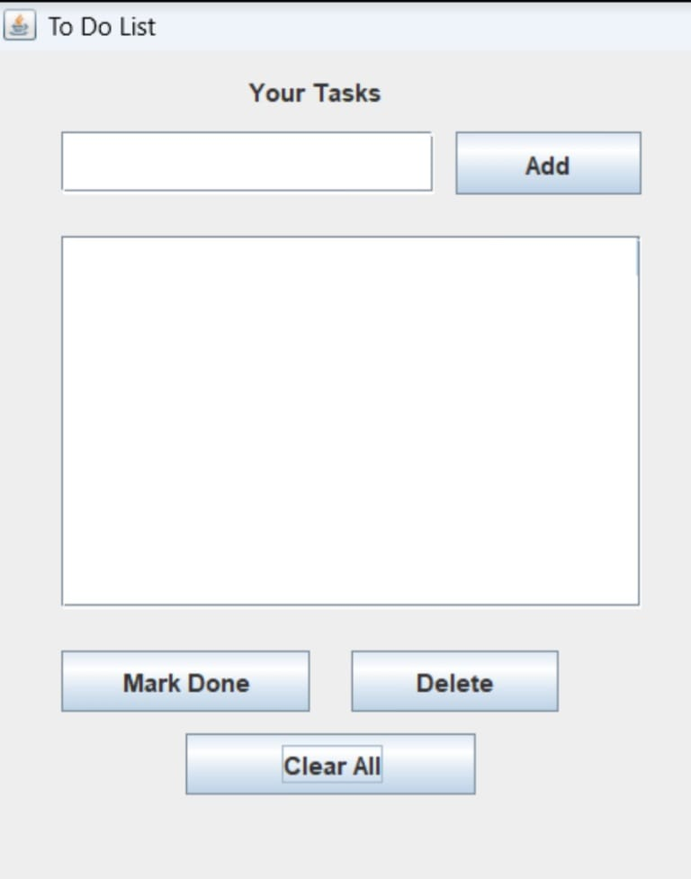
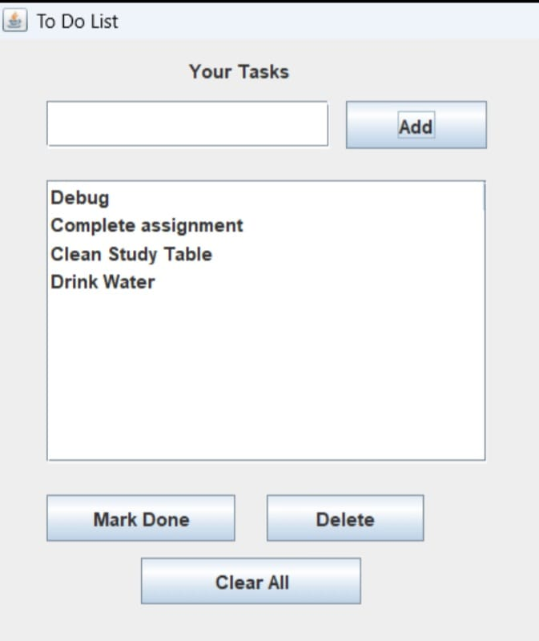

# Java Swing To-Do List 📝

A simple and beginner-friendly To-Do List application built using Java Swing.  
This project allows users to manage daily tasks with a clean GUI interface and file storage support.

---

## ✨ Features

- ➕ Add Tasks
- ✅ Mark Tasks as Done
- ❌ Delete Selected Tasks
- 🧹 Clear All Tasks
- 💾 Automatic File Saving
- 📂 Loads Saved Tasks on Restart
- 🖥️ GUI using Java Swing

---

## 🛠️ Technologies Used

- Java
- Java Swing
- File Handling
- Event Handling

---

## 📸 Project Preview

This application includes:
- TextField for entering tasks
- Scrollable task list
- Buttons for task operations
- Task completion marking using ✓

---

## 🚀 How to Run

1. Clone the repository
git clone <your-repository-link>

2. Open the project in any Java IDE
(VS Code, IntelliJ IDEA, Eclipse, NetBeans)

3. Compile and run:

javac Todo_List.java
java Todo_List

---

🎯 Learning Concepts

This project helped in understanding:

GUI Development using Swing

Buttons and ActionListeners

JList and DefaultListModel

File Handling in Java

Exception Handling

---

## 📸 Screenshots

### 🖥️ Main UI

### 📝 Tasks Added

### ✅ Marked Done

👩‍💻 Author

Shraddha Pawar First Year B.Tech Computer Engineering Student
